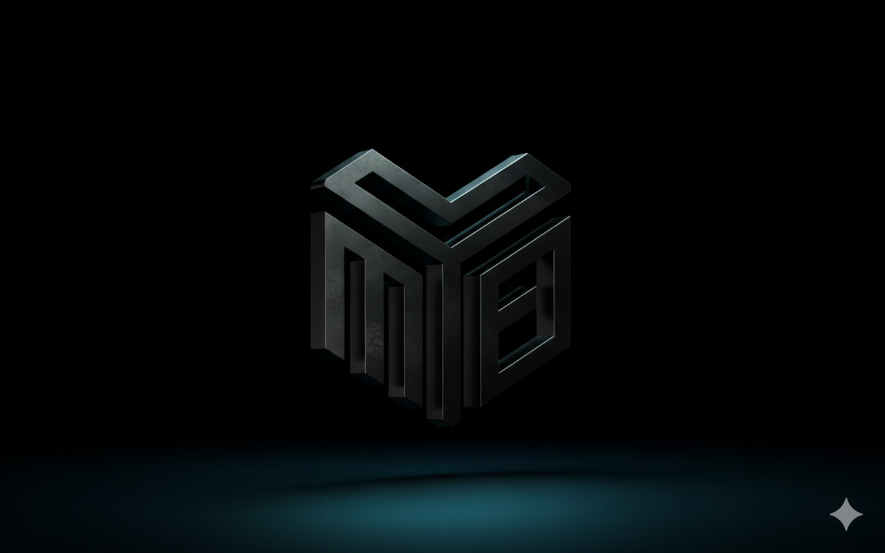
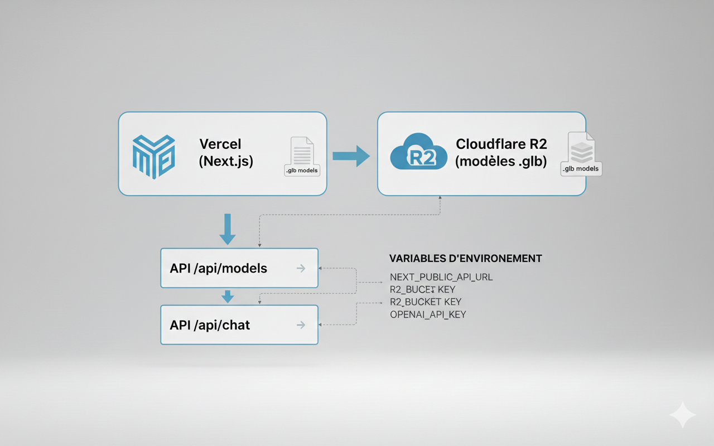
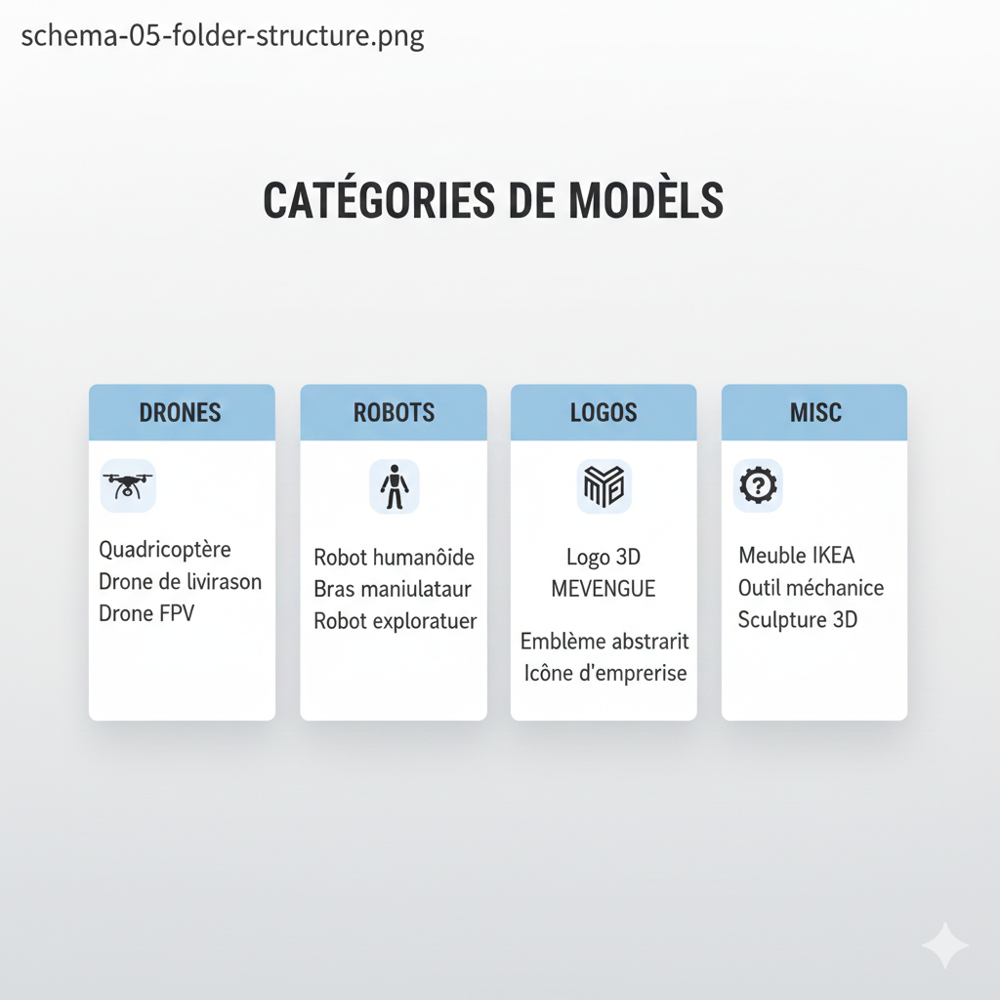

<p align="center">
  
</p>

<h1 align="center">3D Canvas</h1>

<p align="center">
  <a href="https://3-d-canvas-app.vercel.app"></a>
  <a href="#technologies"></a>
  <a href="https://vercel.com"></a>
</p>
<p align="center">
  <strong>Interact with the Future</strong> — Expérience immersive de manipulation 3D par gestes
</p>

<p align="center">
  <a href="https://3-d-canvas-app.vercel.app">🌐 Live Demo</a> •
  <a href="#fonctionnalités">Fonctionnalités</a> •
  <a href="#technologies">Technologies</a> •
  <a href="#configuration">Configuration</a> •
  <a href="#vision-métaverse">Vision Métaverse</a>
</p>

---

## À propos

**3D Canvas** est une application web futuriste permettant d'explorer et manipuler des modèles 3D avec des gestes de main (MediaPipe Hands) ou à la souris. Créée par **Franck MEVENGUE**, étudiant en Architecture Cloud à SUPINFO Paris, ce projet pose les bases d'un futur **métaverse** où ces objets seront réutilisables et interactifs.


<p align="center">
  
</p>


### 🌟 Points forts

- **Interface premium** — Design Apple Vision / sci-fi, glassmorphism, palette cyan/violet
- **Hand tracking** — Contrôle gestuel : pinch pour pivoter, deux mains pour zoomer
- **Modèles 3D** — Catalogue drones, robots, logos hébergés sur Cloudflare R2
- **Chat IA** — Assistant robot intégré (OpenAI ou fallback FAQ)
- **Responsive** — Mobile & desktop, thème clair/sombre


<p align="center">
  
</p>


---

## Fonctionnalités

| Page | Description |
|------|-------------|
| **Home** | Hero avec logo 3D animé, headline « INTERACT WITH THE FUTURE », CTA Explore / How it works |
| **Explore** | Galerie carousel sur plateforme circulaire, View More (+6 objets), navigation par flèches |
| **Object Detail** | Viewer 3D interactif, specs, prix, cercle de contrôle gestuel avec logo |
| **How it works** | Tutoriel gestes (pinch, zoom, pan) |
| **About** | Profil auteur, ASCII cyber, contact |
| **Chat** | Widget flottant, assistant IA ou FAQ locale |

### Interactions

- **Souris** : Orbit controls (glisser, molette, pan)
- **Gestes** : Pinch → rotation, deux mains → zoom, poing → pan
- **Enable** : Active la caméra pour le hand tracking


<p align="center">
  
</p>

---

## Technologies

<p align="center">
  
</p>


| Stack | Outils |
|-------|--------|
| **Framework** | Next.js 14 (App Router) |
| **3D** | React Three Fiber, Three.js, Drei |
| **Gestes** | MediaPipe Hands, @mediapipe/camera_utils |
| **UI** | Tailwind CSS, Framer Motion |
| **État** | Zustand |
| **Stockage** | Cloudflare R2 (modèles .glb) |

<p align="center">
  
</p>

### Architecture

<p align="center">
  
</p>

```
frontend/
├── src/
│   ├── app/              # Routes Next.js
│   │   ├── page.tsx      # Home
│   │   ├── explore/      # Galerie + détail objet
│   │   ├── how-it-works/
│   │   ├── about/
│   │   └── api/          # /api/models, /api/chat
│   ├── components/
│   │   ├── home/         # HeroContent, HeroDecorative, HeroOverlay
│   │   ├── explorer/     # ObjectCard
│   │   ├── shared/       # ModelViewer, InteractionCircle, ObjectInfoPanel
│   │   ├── hand/         # HandTracker, MediaPipe
│   │   └── chat/         # ChatRobot3D, ChatWidget
│   ├── lib/
│   │   ├── models.ts     # Manifest R2, getModelUrl
│   │   └── ...
│   └── contexts/        # ThemeContext
└── public/
```

---

## Configuration

### Prérequis

- Node.js 18+
- Compte Cloudflare R2 (modèles 3D)
- Optionnel : OpenAI API Key (chat IA)

### Variables d'environnement

Créez `frontend/.env.local` :

```env
# Cloudflare R2 — Obligatoire pour les modèles 3D
NEXT_PUBLIC_R2_BASE_URL=https://pub-xxx.r2.dev

# OpenAI — Optionnel (sinon FAQ locale)
OPENAI_API_KEY=sk-...

# Backend — Optionnel
NEXT_PUBLIC_API_URL=https://votre-backend.railway.app
```

### Structure Cloudflare R2

```
bucket/
├── drones/     # dron_V3_hun.glb, drone_V2.glb, ...
├── robots/    # rob_service_hun.glb, ...
├── logos/     # LogoV2hun.glb
└── misc/      # caméra_3D_hun.glb
```

**CORS** : Configurez l'origine `https://votre-app.vercel.app` dans les paramètres R2.

<p align="center">
  
</p>

### Installation

```bash
cd frontend
npm install
npm run dev
```

Ouvrez [http://localhost:3000](http://localhost:3000).

### Déploiement

- **Vercel** : Root Directory = `frontend`, définir les variables d'environnement
- **Railway** (backend) : Voir [docs/DEPLOYMENT.md](docs/DEPLOYMENT.md)

---

## Vision Métaverse

3D Canvas est une **brique fondatrice** pour un futur métaverse :

- **Objets réutilisables** — Modèles GLB catalogués, prêts pour des scènes XR/Web
- **Interactions gestuelles** — Déjà opérationnelles pour Web, extensibles (VR hands, etc.)
- **Architecture modulaire** — World Kernel, systèmes, entités conçus pour évoluer
- **Stockage distribué** — R2 permet de scaler sans limite Vercel

Les objets actuels (drones, robots, caméras) pourront être instanciés dans des environnements partagés, avec avatars et interactions multi-utilisateurs.

---

## Documentation

| Fichier | Contenu |
|---------|---------|
| [docs/README.md](docs/README.md) | Index de la documentation |
| [docs/DEPLOYMENT.md](docs/DEPLOYMENT.md) | Guide Vercel + Railway, config R2, CORS |
| [images/README.md](images/README.md) | Liste des images et conventions de chemins |

---

## Auteur

**Franck MEVENGUE**  
Étudiant en Architecture Cloud, Systèmes & Réseaux — SUPINFO Paris  

- 📧 [mevenguefranck@gmail.com](mailto:mevenguefranck@gmail.com)
- 💼 [LinkedIn](https://www.linkedin.com/in/franck-mevengue/)
- 💻 [GitHub](https://github.com/MEVENGUE)

---

<p align="center">
  <sub>© 2025 — Seamless gestural control. Experience the next dimension.</sub>
</p>
